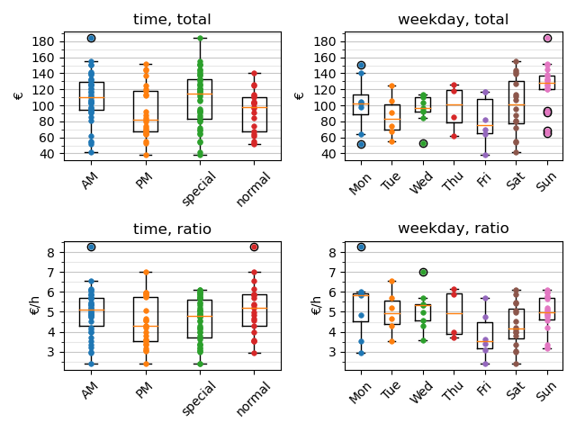

last update: 21.05.2024, Tuesday, time: 18:12
# Statistic  
Holiday: Holiday in Germany NRW and Friday till Sunday  
## Overview  
total: 109.584 +/- 31.008  
ratio:   5.136 +/-  1.100  
bar:    45.137 +/- 19.811  
card:   57.640 +/- 27.028  
  
  
### Top three: total  
&nbsp;|total|ratio|timestamp
---|---|---|---
1":|186.83€|6.126€/h|03.03.2024 Sun AM
&nbsp;|&nbsp;|&nbsp;|holiday -> False
2":|184.50€|6.099€/h|13.08.2023 Sun AM
&nbsp;|&nbsp;|&nbsp;|holiday -> False
3":|180.09€|7.504€/h|28.04.2024 Sun AM
&nbsp;|&nbsp;|&nbsp;|holiday -> False
  
  
### Top three: ratio  
&nbsp;|ratio|total|timestamp
---|---|---|---
1":|8.266€/h|140.53€|25.09.2023 Mon AM
&nbsp;|&nbsp;|&nbsp;|holiday -> False
2":|7.941€/h|142.93€|22.03.2024 Fri AM
&nbsp;|&nbsp;|&nbsp;|holiday -> False
3":|7.550€/h|166.09€|19.11.2023 Sun PM
&nbsp;|&nbsp;|&nbsp;|holiday -> False
  
  
### AM  
total: 111.373 +/- 28.757  
ratio:   5.198 +/-  1.002  
  
### PM  
total: 106.482 +/- 34.347  
ratio:   5.028 +/-  1.245  
  
  
### Holidays with weekends (Fri - Sun)  
total: 115.120 +/- 30.693  
ratio:   5.226 +/-  1.075  
  
### Normal days  
total:  89.628 +/- 22.870  
ratio:   4.811 +/-  1.127  
  
  
Monday  
total: 100.529 +/- 24.673  
ratio:   5.466 +/-  1.157  
  
Tuesday  
total:  87.616 +/- 17.869  
ratio:   4.962 +/-  1.072  
  
Wednesday  
total:  95.820 +/- 17.184  
ratio:   5.161 +/-  0.853  
  
Thursday  
total:  88.162 +/- 18.697  
ratio:   4.760 +/-  0.982  
  
Friday  
total: 104.350 +/- 24.752  
ratio:   4.922 +/-  1.130  
  
Saturday  
total: 116.059 +/- 31.648  
ratio:   4.938 +/-  1.082  
  
Sunday  
total: 138.032 +/- 28.178  
ratio:   5.495 +/-  1.090  
  
  
### Frequency  
total: 175, AM: 111, PM: 64  
███████████▍ 20, 11.4%  
██████████▎ 18, 10.3%  
███████████▍ 20, 11.4%  
██████████▎ 18, 10.3%  
██████████████▊ 26, 14.9%  
██████████████████▎ 32, 18.3%  
███████████████████████▍ 41, 23.4%  
  
  
## Plot  
