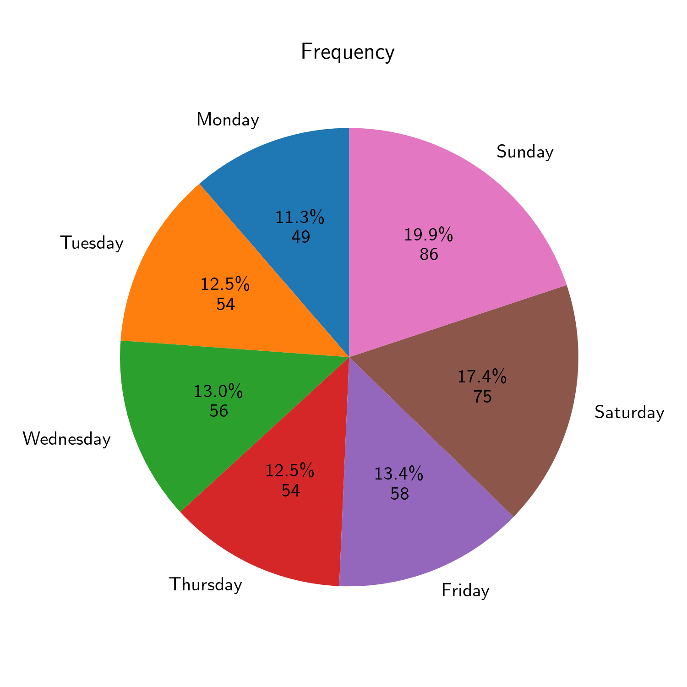

last update: 15.10.2024, Tuesday, time: 20:21  
# Panorama  
|| Whole | Half |  
|---|---|---|  
|Total $/ \textup{€}$|193.207 $\pm$ 55.054|109.354 $\pm$ 31.234|  
|Ratio $/ \frac{\textup{€}}{\textup{h}}$| 4.518 $\pm$  0.786| 5.129 $\pm$  1.105|  
|Cash $/ \textup{€}$|65.951 $\pm$ 35.111|43.607 $\pm$ 21.058|  
|Cash $/ \\% $|41.354 $\pm$  8.417|43.982 $\pm$  9.854|  
|Card $/ \textup{€}$|95.184 $\pm$ 52.434|56.617 $\pm$ 28.702|  
|Card $/ \\% $|58.646 $\pm$  8.417|56.018 $\pm$  9.854|  
# Cake  
    
  
# Total / Ratio  
## Whole day  
||Total $/ \textup{€}$|Ratio $/ \frac{\textup{€}}{\textup{h}}$|Timestamp|Holiday|  
|---|---|---|---|---|  
|1"|334.35|  6.52|22.10.2023 Sun|False|  
|2"|334.35|  6.52|22.10.2023 Sun|False|  
|3"|322.02|  6.05|13.08.2023 Sun|False|  
  
  
||Ratio $/ \frac{\textup{€}}{\textup{h}}$|Total $/ \textup{€}$|Timestamp|Holiday|  
|---|---|---|---|---|  
|1"|  6.52|334.35|22.10.2023 Sun|False|  
|2"|  6.52|334.35|22.10.2023 Sun|False|  
|3"|  6.47|301.01|28.04.2024 Sun|False|  
  
  
    
  
## Half day  
||Total $/ \textup{€}$|Ratio $/ \frac{\textup{€}}{\textup{h}}$|Timestamp|Holiday|  
|---|---|---|---|---|  
|1"|186.83|  6.13|03.03.2024 Sun AM|False|  
|2"|184.50|  6.10|13.08.2023 Sun AM|False|  
|3"|180.09|  7.50|28.04.2024 Sun AM|False|  
  
  
||Ratio $/ \frac{\textup{€}}{\textup{h}}$|Total $/ \textup{€}$|Timestamp|Holiday|  
|---|---|---|---|---|  
|1"|  8.27|140.53|25.09.2023 Mon AM|False|  
|2"|  7.94|142.93|22.03.2024 Fri AM|False|  
|3"|  7.55|166.09|19.11.2023 Sun PM|False|  
  
  
    
  
# Seven Days A Week  
|||Whole|Half|  
|---|---|---|---|  
|Monday|Total $/ \textup{€}$|158.77 $\pm$ 36.36|101.02 $\pm$ 23.93|  
||Ratio $/ \frac{\textup{€}}{\textup{h}}$|  4.13 $\pm$  0.74|  5.41 $\pm$  1.12|  
|Tuesday|Total $/ \textup{€}$|160.40 $\pm$ 37.40| 87.62 $\pm$ 17.87|  
||Ratio $/ \frac{\textup{€}}{\textup{h}}$|  4.38 $\pm$  0.82|  4.96 $\pm$  1.07|  
|Wednesday|Total $/ \textup{€}$|165.90 $\pm$ 28.60| 93.17 $\pm$ 20.39|  
||Ratio $/ \frac{\textup{€}}{\textup{h}}$|  4.47 $\pm$  0.75|  5.10 $\pm$  1.05|  
|Thursday|Total $/ \textup{€}$|154.51 $\pm$ 44.26| 88.34 $\pm$ 18.21|  
||Ratio $/ \frac{\textup{€}}{\textup{h}}$|  4.12 $\pm$  0.64|  4.77 $\pm$  0.96|  
|Friday|Total $/ \textup{€}$|195.97 $\pm$ 35.36|104.48 $\pm$ 25.23|  
||Ratio $/ \frac{\textup{€}}{\textup{h}}$|  4.42 $\pm$  0.73|  4.96 $\pm$  1.14|  
|Saturday|Total $/ \textup{€}$|222.84 $\pm$ 44.02|117.47 $\pm$ 31.42|  
||Ratio $/ \frac{\textup{€}}{\textup{h}}$|  4.58 $\pm$  0.63|  4.94 $\pm$  1.05|  
|Sunday|Total $/ \textup{€}$|255.95 $\pm$ 45.84|138.03 $\pm$ 28.18|  
||Ratio $/ \frac{\textup{€}}{\textup{h}}$|  5.16 $\pm$  0.65|  5.49 $\pm$  1.09|  
# Make Me Feel Special  
Special: Holidays and Weekends  
## Whole day  
||Total $/ \textup{€}$|Ratio $/ \frac{\textup{€}}{\textup{h}}$|Count|  
|---|---|---|---|  
|All|193.21 $\pm$ 55.05|  4.52 $\pm$  0.79|236  
|Normal|167.61 $\pm$ 39.57|  4.32 $\pm$  0.76|153  
|Weekend|240.39 $\pm$ 47.93|  4.89 $\pm$  0.70|83  
|Holiday|184.60 $\pm$ 54.95|  4.46 $\pm$  0.84|64  
|Special|214.09 $\pm$ 59.52|  4.68 $\pm$  0.80|128  
|Special \& Friday|211.87 $\pm$ 56.26|  4.65 $\pm$  0.79|153  
    
  
## Half day  
||Total $/ \textup{€}$|Ratio $/ \frac{\textup{€}}{\textup{h}}$|Count|  
|---|---|---|---|  
|All|109.35 $\pm$ 31.23|  5.13 $\pm$  1.10|181  
|Normal| 95.66 $\pm$ 22.70|  5.05 $\pm$  1.09|106  
|Weekend|128.71 $\pm$ 31.41|  5.24 $\pm$  1.11|75  
|Holiday|108.86 $\pm$ 28.20|  5.02 $\pm$  1.07|30  
|Special|123.67 $\pm$ 32.06|  5.21 $\pm$  1.11|92  
|Special \& Friday|120.68 $\pm$ 31.06|  5.19 $\pm$  1.10|113  
    
  
# AM / PM  
## AM  
||Total $/ \textup{€}$|Ratio $/ \frac{\textup{€}}{\textup{h}}$|Count|  
|---|---|---|---|  
|All|111.37 $\pm$ 28.80|  5.22 $\pm$  0.99|114  
|Normal| 99.61 $\pm$ 19.99|  5.33 $\pm$  1.00|70  
|Weekend|130.06 $\pm$ 30.73|  5.04 $\pm$  0.95|44  
|Holiday|112.39 $\pm$ 24.57|  5.14 $\pm$  0.96|18  
|Special|126.51 $\pm$ 30.02|  5.13 $\pm$  0.94|54  
|Special \& Friday|124.14 $\pm$ 28.36|  5.20 $\pm$  0.96|65  
    
  
## PM  
||Total $/ \textup{€}$|Ratio $/ \frac{\textup{€}}{\textup{h}}$|Count|  
|---|---|---|---|  
|All|105.93 $\pm$ 34.72|  4.98 $\pm$  1.26|67  
|Normal| 87.97 $\pm$ 25.50|  4.50 $\pm$  1.06|36  
|Weekend|126.79 $\pm$ 32.24|  5.53 $\pm$  1.25|31  
|Holiday|103.55 $\pm$ 32.18|  4.84 $\pm$  1.18|12  
|Special|119.63 $\pm$ 34.34|  5.34 $\pm$  1.30|38  
|Special \& Friday|116.00 $\pm$ 33.82|  5.19 $\pm$  1.26|48  
    
  
