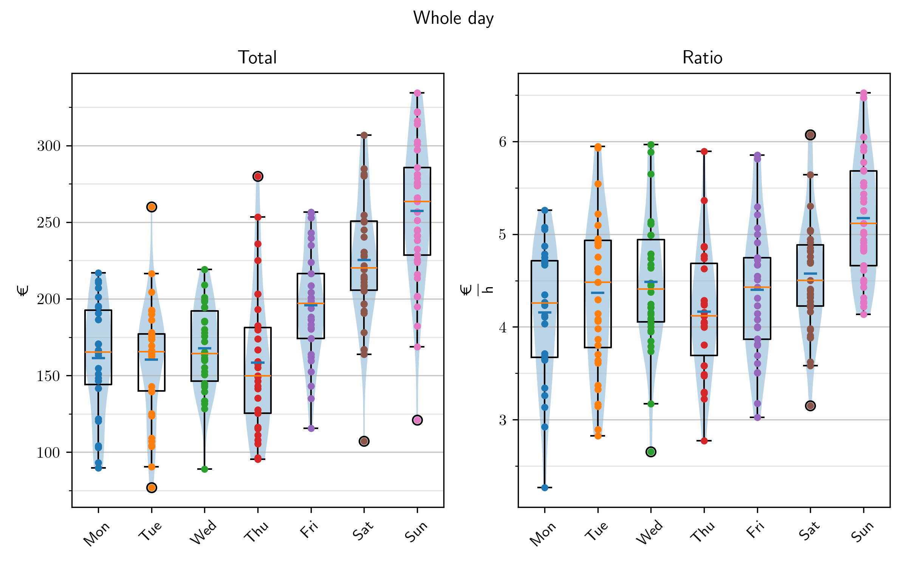

last update: 17.10.2024, Thursday, time: 20:29  
# Panorama  
|| Whole | Half |  
|---|---|---|  
|Total $/ \textup{€}$|193.608 $\pm$ 54.673|109.544 $\pm$ 30.927|  
|Ratio $/ \frac{\textup{€}}{\textup{h}}$| 4.518 $\pm$  0.783| 5.102 $\pm$  1.108|  
|Cash $/ \textup{€}$|66.345 $\pm$ 34.959|42.721 $\pm$ 21.473|  
|Cash $/ \\% $|41.450 $\pm$  8.288|43.644 $\pm$ 10.075|  
|Card $/ \textup{€}$|95.460 $\pm$ 52.276|56.304 $\pm$ 29.520|  
|Card $/ \\% $|58.550 $\pm$  8.288|56.356 $\pm$ 10.075|  
# Cake  
    
  
# Total / Ratio  
## Whole day  
||Total $/ \textup{€}$|Ratio $/ \frac{\textup{€}}{\textup{h}}$|Timestamp|Holiday|  
|---|---|---|---|---|  
|1"|334.35|  6.52|22.10.2023 Sun|False|  
|2"|334.35|  6.52|22.10.2023 Sun|False|  
|3"|322.02|  6.05|13.08.2023 Sun|False|  
  
  
||Ratio $/ \frac{\textup{€}}{\textup{h}}$|Total $/ \textup{€}$|Timestamp|Holiday|  
|---|---|---|---|---|  
|1"|  6.52|334.35|22.10.2023 Sun|False|  
|2"|  6.52|334.35|22.10.2023 Sun|False|  
|3"|  6.47|301.01|28.04.2024 Sun|False|  
  
  
    
  
## Half day  
||Total $/ \textup{€}$|Ratio $/ \frac{\textup{€}}{\textup{h}}$|Timestamp|Holiday|  
|---|---|---|---|---|  
|1"|186.83|  6.13|03.03.2024 Sun AM|False|  
|2"|184.50|  6.10|13.08.2023 Sun AM|False|  
|3"|180.09|  7.50|28.04.2024 Sun AM|False|  
  
  
||Ratio $/ \frac{\textup{€}}{\textup{h}}$|Total $/ \textup{€}$|Timestamp|Holiday|  
|---|---|---|---|---|  
|1"|  8.27|140.53|25.09.2023 Mon AM|False|  
|2"|  7.94|142.93|22.03.2024 Fri AM|False|  
|3"|  7.55|166.09|19.11.2023 Sun PM|False|  
  
  
    
  
# Seven Days A Week  
|||Whole|Half|  
|---|---|---|---|  
|Monday|Total $/ \textup{€}$|161.01 $\pm$ 37.38|101.02 $\pm$ 23.93|  
||Ratio $/ \frac{\textup{€}}{\textup{h}}$|  4.16 $\pm$  0.74|  5.41 $\pm$  1.12|  
|Tuesday|Total $/ \textup{€}$|160.40 $\pm$ 37.40| 87.62 $\pm$ 17.87|  
||Ratio $/ \frac{\textup{€}}{\textup{h}}$|  4.38 $\pm$  0.82|  4.96 $\pm$  1.07|  
|Wednesday|Total $/ \textup{€}$|166.88 $\pm$ 28.71| 93.17 $\pm$ 20.39|  
||Ratio $/ \frac{\textup{€}}{\textup{h}}$|  4.48 $\pm$  0.74|  5.10 $\pm$  1.05|  
|Thursday|Total $/ \textup{€}$|155.80 $\pm$ 44.06| 92.39 $\pm$ 20.84|  
||Ratio $/ \frac{\textup{€}}{\textup{h}}$|  4.13 $\pm$  0.63|  4.68 $\pm$  0.99|  
|Friday|Total $/ \textup{€}$|195.97 $\pm$ 35.36|104.48 $\pm$ 25.23|  
||Ratio $/ \frac{\textup{€}}{\textup{h}}$|  4.42 $\pm$  0.73|  4.96 $\pm$  1.14|  
|Saturday|Total $/ \textup{€}$|225.38 $\pm$ 41.69|117.75 $\pm$ 30.57|  
||Ratio $/ \frac{\textup{€}}{\textup{h}}$|  4.58 $\pm$  0.64|  4.90 $\pm$  1.03|  
|Sunday|Total $/ \textup{€}$|255.95 $\pm$ 45.84|138.03 $\pm$ 28.18|  
||Ratio $/ \frac{\textup{€}}{\textup{h}}$|  5.16 $\pm$  0.65|  5.49 $\pm$  1.09|  
# Make Me Feel Special  
Special: Holidays and Weekends  
## Whole day  
||Total $/ \textup{€}$|Ratio $/ \frac{\textup{€}}{\textup{h}}$|Count|  
|---|---|---|---|  
|All|193.61 $\pm$ 54.67|  4.52 $\pm$  0.78|238  
|Normal|168.29 $\pm$ 39.51|  4.32 $\pm$  0.75|156  
|Weekend|241.78 $\pm$ 46.53|  4.89 $\pm$  0.71|82  
|Holiday|185.42 $\pm$ 53.88|  4.46 $\pm$  0.82|67  
|Special|214.50 $\pm$ 58.60|  4.67 $\pm$  0.79|130  
|Special \& Friday|212.24 $\pm$ 55.50|  4.65 $\pm$  0.78|155  
    
  
## Half day  
||Total $/ \textup{€}$|Ratio $/ \frac{\textup{€}}{\textup{h}}$|Count|  
|---|---|---|---|  
|All|109.54 $\pm$ 30.93|  5.10 $\pm$  1.11|187  
|Normal| 96.24 $\pm$ 22.86|  5.02 $\pm$  1.10|110  
|Weekend|128.55 $\pm$ 31.02|  5.22 $\pm$  1.10|77  
|Holiday|109.18 $\pm$ 27.53|  4.93 $\pm$  1.09|34  
|Special|123.15 $\pm$ 31.46|  5.16 $\pm$  1.12|98  
|Special \& Friday|120.41 $\pm$ 30.58|  5.15 $\pm$  1.10|119  
    
  
# AM / PM  
## AM  
||Total $/ \textup{€}$|Ratio $/ \frac{\textup{€}}{\textup{h}}$|Count|  
|---|---|---|---|  
|All|111.73 $\pm$ 28.54|  5.21 $\pm$  0.98|117  
|Normal|100.33 $\pm$ 20.19|  5.33 $\pm$  0.99|72  
|Weekend|129.98 $\pm$ 30.40|  5.03 $\pm$  0.94|45  
|Holiday|113.68 $\pm$ 23.74|  5.16 $\pm$  0.92|20  
|Special|126.47 $\pm$ 29.26|  5.12 $\pm$  0.92|57  
|Special \& Friday|124.21 $\pm$ 27.76|  5.19 $\pm$  0.94|68  
    
  
## PM  
||Total $/ \textup{€}$|Ratio $/ \frac{\textup{€}}{\textup{h}}$|Count|  
|---|---|---|---|  
|All|105.88 $\pm$ 34.24|  4.91 $\pm$  1.27|70  
|Normal| 88.49 $\pm$ 25.46|  4.43 $\pm$  1.07|38  
|Weekend|126.54 $\pm$ 31.77|  5.48 $\pm$  1.25|32  
|Holiday|102.75 $\pm$ 31.06|  4.61 $\pm$  1.23|14  
|Special|118.55 $\pm$ 33.76|  5.21 $\pm$  1.34|41  
|Special \& Friday|115.34 $\pm$ 33.30|  5.09 $\pm$  1.29|51  
    
  
