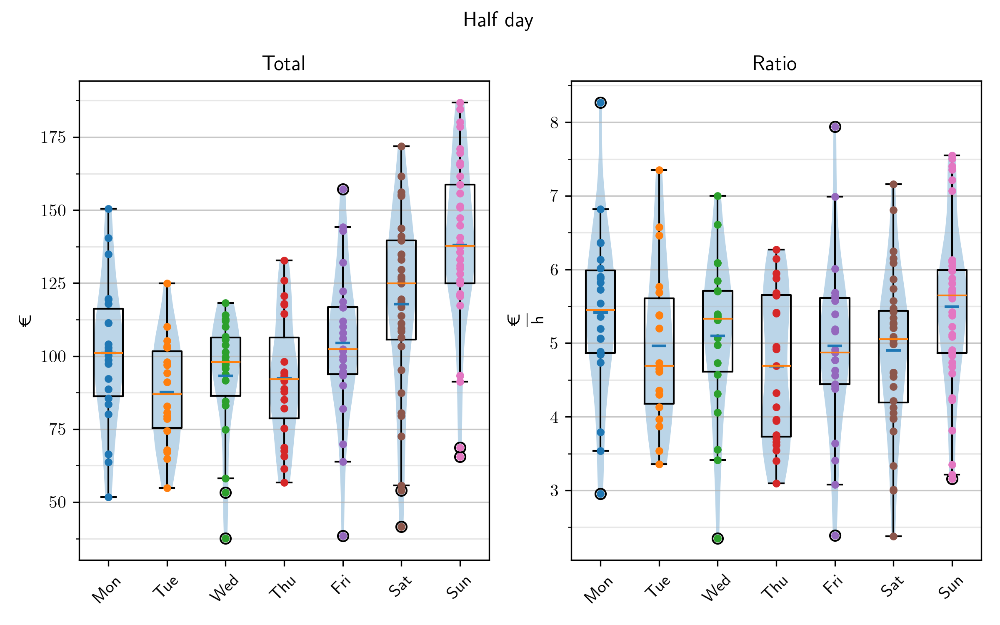

last update: 18.10.2024, Friday, time: 12:36  
# Panorama  
|| Whole | Half |  
|---|---|---|  
|Total $/ \textup{€}$|193.608 $\pm$ 54.673|109.544 $\pm$ 30.927|  
|Ratio $/ \frac{\textup{€}}{\textup{h}}$| 4.518 $\pm$  0.783| 5.102 $\pm$  1.108|  
|Cash $/ \textup{€}$|66.345 $\pm$ 34.959|42.721 $\pm$ 21.473|  
|Cash $/ \\% $|41.450 $\pm$  8.288|43.644 $\pm$ 10.075|  
|Card $/ \textup{€}$|95.460 $\pm$ 52.276|56.304 $\pm$ 29.520|  
|Card $/ \\% $|58.550 $\pm$  8.288|56.356 $\pm$ 10.075|  
# Cake  
    
  
# No. 1  
## Whole day  
||Total $/ \textup{€}$|Ratio $/ \frac{\textup{€}}{\textup{h}}$|Timestamp|Holiday|  
|---|---|---|---|---|  
|1"|334.35|  6.52|22.10.2023 Sun|False|  
|2"|334.35|  6.52|22.10.2023 Sun|False|  
|3"|322.02|  6.05|13.08.2023 Sun|False|  
|4"|322.02|  6.05|13.08.2023 Sun|False|  
|5"|321.66|  5.90|06.10.2024 Sun|False|  
  
  
||Ratio $/ \frac{\textup{€}}{\textup{h}}$|Total $/ \textup{€}$|Timestamp|Holiday|  
|---|---|---|---|---|  
|1"|  6.52|334.35|22.10.2023 Sun|False|  
|2"|  6.52|334.35|22.10.2023 Sun|False|  
|3"|  6.47|301.01|28.04.2024 Sun|False|  
|4"|  6.08|306.78|14.10.2023 Sat|Herbstferien|  
|5"|  6.07|306.78|14.10.2023 Sat|Herbstferien|  
  
  
    
  
## Half day  
||Total $/ \textup{€}$|Ratio $/ \frac{\textup{€}}{\textup{h}}$|Timestamp|Holiday|  
|---|---|---|---|---|  
|1"|186.83|  6.13|03.03.2024 Sun AM|False|  
|2"|184.50|  6.10|13.08.2023 Sun AM|False|  
|3"|180.09|  7.50|28.04.2024 Sun AM|False|  
|4"|178.60|  7.22|22.10.2023 Sun PM|False|  
|5"|171.88|  6.81|14.10.2023 Sat PM|Herbstferien|  
  
  
||Ratio $/ \frac{\textup{€}}{\textup{h}}$|Total $/ \textup{€}$|Timestamp|Holiday|  
|---|---|---|---|---|  
|1"|  8.27|140.53|25.09.2023 Mon AM|False|  
|2"|  7.94|142.93|22.03.2024 Fri AM|False|  
|3"|  7.55|166.09|19.11.2023 Sun PM|False|  
|4"|  7.50|180.09|28.04.2024 Sun AM|False|  
|5"|  7.40|140.58|14.01.2024 Sun PM|False|  
  
  
    
  
# Seven Days A Week  
|||Whole|Half|  
|---|---|---|---|  
|Monday|Total $/ \textup{€}$|161.01 $\pm$ 37.38|101.02 $\pm$ 23.93|  
||Ratio $/ \frac{\textup{€}}{\textup{h}}$|  4.16 $\pm$  0.74|  5.41 $\pm$  1.12|  
|Tuesday|Total $/ \textup{€}$|160.40 $\pm$ 37.40| 87.62 $\pm$ 17.87|  
||Ratio $/ \frac{\textup{€}}{\textup{h}}$|  4.38 $\pm$  0.82|  4.96 $\pm$  1.07|  
|Wednesday|Total $/ \textup{€}$|166.88 $\pm$ 28.71| 93.17 $\pm$ 20.39|  
||Ratio $/ \frac{\textup{€}}{\textup{h}}$|  4.48 $\pm$  0.74|  5.10 $\pm$  1.05|  
|Thursday|Total $/ \textup{€}$|155.80 $\pm$ 44.06| 92.39 $\pm$ 20.84|  
||Ratio $/ \frac{\textup{€}}{\textup{h}}$|  4.13 $\pm$  0.63|  4.68 $\pm$  0.99|  
|Friday|Total $/ \textup{€}$|195.97 $\pm$ 35.36|104.48 $\pm$ 25.23|  
||Ratio $/ \frac{\textup{€}}{\textup{h}}$|  4.42 $\pm$  0.73|  4.96 $\pm$  1.14|  
|Saturday|Total $/ \textup{€}$|225.38 $\pm$ 41.69|117.75 $\pm$ 30.57|  
||Ratio $/ \frac{\textup{€}}{\textup{h}}$|  4.58 $\pm$  0.64|  4.90 $\pm$  1.03|  
|Sunday|Total $/ \textup{€}$|255.95 $\pm$ 45.84|138.03 $\pm$ 28.18|  
||Ratio $/ \frac{\textup{€}}{\textup{h}}$|  5.16 $\pm$  0.65|  5.49 $\pm$  1.09|  
# Make Me Feel Special  
Special: Holidays and Weekends  
## Whole day  
||Total $/ \textup{€}$|Ratio $/ \frac{\textup{€}}{\textup{h}}$|Count|  
|---|---|---|---|  
|All|193.61 $\pm$ 54.67|  4.52 $\pm$  0.78|238  
|Weekday|168.29 $\pm$ 39.51|  4.32 $\pm$  0.75|156  
|Weekend|241.78 $\pm$ 46.53|  4.89 $\pm$  0.71|82  
|Holiday|185.42 $\pm$ 53.88|  4.46 $\pm$  0.82|67  
|Special|214.50 $\pm$ 58.60|  4.67 $\pm$  0.79|130  
|Special \& Friday|212.24 $\pm$ 55.50|  4.65 $\pm$  0.78|155  
    
  
## Half day  
||Total $/ \textup{€}$|Ratio $/ \frac{\textup{€}}{\textup{h}}$|Count|  
|---|---|---|---|  
|All|109.54 $\pm$ 30.93|  5.10 $\pm$  1.11|187  
|Weekday| 96.24 $\pm$ 22.86|  5.02 $\pm$  1.10|110  
|Weekend|128.55 $\pm$ 31.02|  5.22 $\pm$  1.10|77  
|Holiday|109.18 $\pm$ 27.53|  4.93 $\pm$  1.09|34  
|Special|123.15 $\pm$ 31.46|  5.16 $\pm$  1.12|98  
|Special \& Friday|120.41 $\pm$ 30.58|  5.15 $\pm$  1.10|119  
    
  
# 2PM  
## AM  
||Total $/ \textup{€}$|Ratio $/ \frac{\textup{€}}{\textup{h}}$|Count|  
|---|---|---|---|  
|All|111.73 $\pm$ 28.54|  5.21 $\pm$  0.98|117  
|Weekday|100.33 $\pm$ 20.19|  5.33 $\pm$  0.99|72  
|Weekend|129.98 $\pm$ 30.40|  5.03 $\pm$  0.94|45  
|Holiday|113.68 $\pm$ 23.74|  5.16 $\pm$  0.92|20  
|Special|126.47 $\pm$ 29.26|  5.12 $\pm$  0.92|57  
|Special \& Friday|124.21 $\pm$ 27.76|  5.19 $\pm$  0.94|68  
    
  
## PM  
||Total $/ \textup{€}$|Ratio $/ \frac{\textup{€}}{\textup{h}}$|Count|  
|---|---|---|---|  
|All|105.88 $\pm$ 34.24|  4.91 $\pm$  1.27|70  
|Weekday| 88.49 $\pm$ 25.46|  4.43 $\pm$  1.07|38  
|Weekend|126.54 $\pm$ 31.77|  5.48 $\pm$  1.25|32  
|Holiday|102.75 $\pm$ 31.06|  4.61 $\pm$  1.23|14  
|Special|118.55 $\pm$ 33.76|  5.21 $\pm$  1.34|41  
|Special \& Friday|115.34 $\pm$ 33.30|  5.09 $\pm$  1.29|51  
    
  
# Month And The Weekend  
| Month || Total $/ \textup{€}$ | Ratio $/ \frac{\textup{€}}{\textup{h}}$ |  
|---|---|---|---|  
January |All|121.44 $\pm$ 25.93|5.52 $\pm$ 1.12  
||Weekday|106.52 $\pm$ 20.77|5.43 $\pm$ 0.64  
||Weekend|133.36 $\pm$ 23.35|5.60 $\pm$ 1.39  
February |All|118.04 $\pm$ 30.68|5.86 $\pm$ 0.84  
||Weekday|99.61 $\pm$ 12.34|5.85 $\pm$ 0.86  
||Weekend|154.90 $\pm$ 21.94|5.89 $\pm$ 0.79  
March |All|112.09 $\pm$ 35.77|5.30 $\pm$ 1.17  
||Weekday|97.41 $\pm$ 26.43|5.40 $\pm$ 1.21  
||Weekend|131.66 $\pm$ 37.19|5.17 $\pm$ 1.10  
April |All|127.48 $\pm$ 51.02|5.44 $\pm$ 1.11  
||Weekday|109.16 $\pm$ 25.56|5.24 $\pm$ 1.14  
||Weekend|161.06 $\pm$ 66.60|5.80 $\pm$ 0.95  
May |All|192.84 $\pm$ 44.09|4.41 $\pm$ 0.66  
||Weekday|178.84 $\pm$ 42.01|4.29 $\pm$ 0.68  
||Weekend|231.35 $\pm$ 20.33|4.76 $\pm$ 0.45  
June |All|169.25 $\pm$ 44.99|4.15 $\pm$ 0.73  
||Weekday|147.67 $\pm$ 34.15|4.05 $\pm$ 0.82  
||Weekend|212.40 $\pm$ 30.75|4.35 $\pm$ 0.44  
July |All|168.01 $\pm$ 59.73|4.39 $\pm$ 0.90  
||Weekday|158.14 $\pm$ 45.74|4.17 $\pm$ 0.79  
||Weekend|182.82 $\pm$ 73.58|4.72 $\pm$ 0.95  
August |All|154.88 $\pm$ 61.44|4.50 $\pm$ 0.93  
||Weekday|128.25 $\pm$ 37.95|4.34 $\pm$ 0.99  
||Weekend|185.95 $\pm$ 68.61|4.69 $\pm$ 0.82  
September |All|160.31 $\pm$ 63.34|4.78 $\pm$ 0.90  
||Weekday|141.71 $\pm$ 49.05|4.73 $\pm$ 1.00  
||Weekend|198.23 $\pm$ 71.70|4.90 $\pm$ 0.63  
October |All|176.16 $\pm$ 72.92|4.91 $\pm$ 0.94  
||Weekday|148.70 $\pm$ 56.24|4.48 $\pm$ 0.79  
||Weekend|209.12 $\pm$ 76.88|5.43 $\pm$ 0.83  
November |All|140.32 $\pm$ 64.45|4.79 $\pm$ 0.95  
||Weekday|133.73 $\pm$ 55.86|4.70 $\pm$ 0.80  
||Weekend|189.08 $\pm$ 95.39|5.42 $\pm$ 1.52  
December |All|144.67 $\pm$ 60.95|5.16 $\pm$ 0.52  
||Weekday|111.83 $\pm$ 35.38|4.92 $\pm$ 0.64  
||Weekend|169.94 $\pm$ 64.36|5.34 $\pm$ 0.31  
    
  
