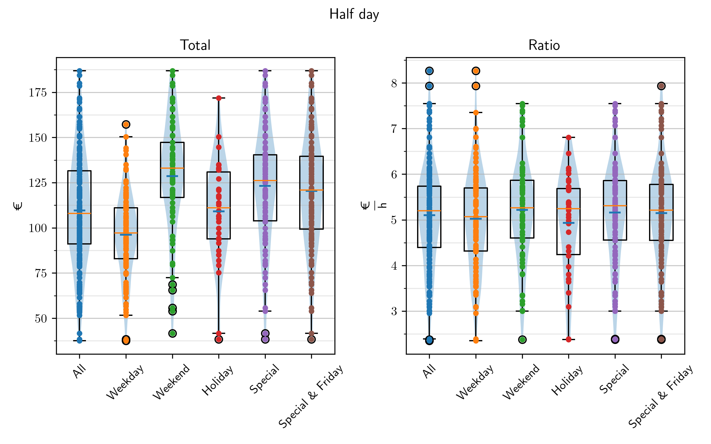
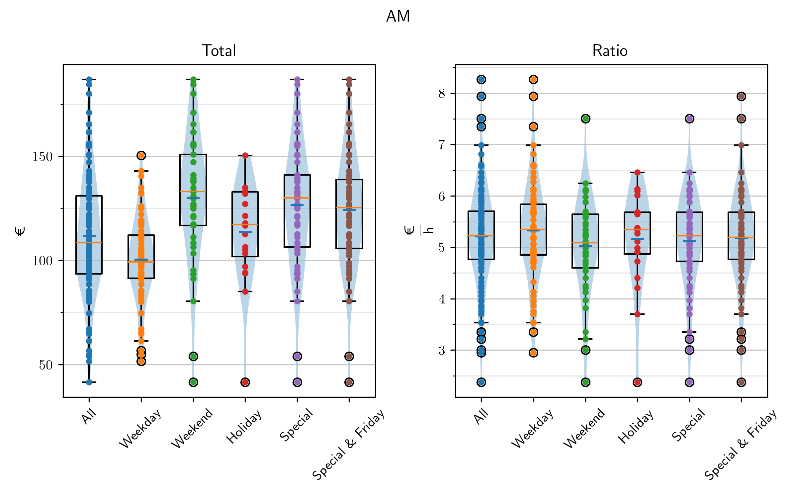
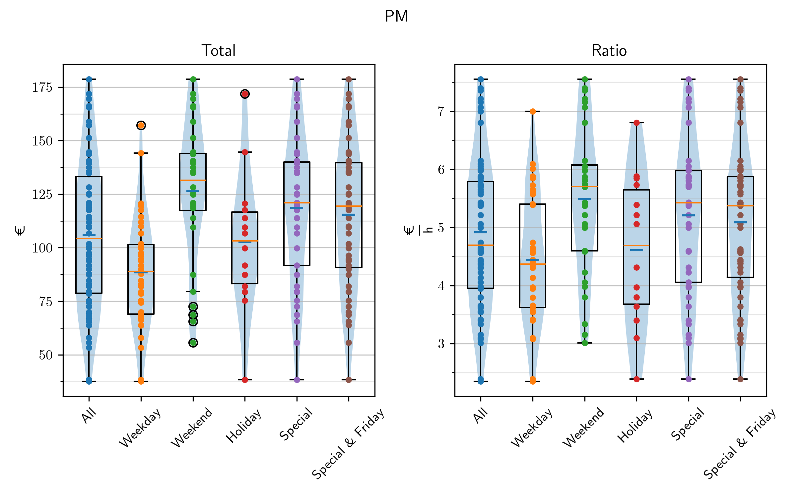

last update: 05.10.2024, Saturday, time: 18:44  
# Overview  
|| Whole | Half |  
|---|---|---|  
|Total $/ \textup{€}$|191.450 $\pm$ 54.688|109.011 $\pm$ 31.199|  
|Ratio $/ \frac{\textup{€}}{\textup{h}}$| 4.517 $\pm$  0.793| 5.132 $\pm$  1.110|  
|Cash $/ \textup{€}$|64.289 $\pm$ 35.365|43.881 $\pm$ 20.917|  
|Cash $/ \\% $|41.426 $\pm$  8.444|44.103 $\pm$  9.766|  
|Card $/ \textup{€}$|92.440 $\pm$ 52.322|56.598 $\pm$ 28.195|  
|Card $/ \\% $|58.574 $\pm$  8.444|55.897 $\pm$  9.766|  
# Frequency  
    
  
# Total / Ratio  
## Whole day  
||Total $/ \textup{€}$|Ratio $/ \frac{\textup{€}}{\textup{h}}$|Timestamp|Holiday|  
|---|---|---|---|---|  
|1"|334.35|  6.52|22.10.2023 Sun|False|  
|2"|334.35|  6.52|22.10.2023 Sun|False|  
|3"|322.02|  6.05|13.08.2023 Sun|False|  
  
  
||Ratio $/ \frac{\textup{€}}{\textup{h}}$|Total $/ \textup{€}$|Timestamp|Holiday|  
|---|---|---|---|---|  
|1"|  6.52|334.35|22.10.2023 Sun|False|  
|2"|  6.52|334.35|22.10.2023 Sun|False|  
|3"|  6.47|301.01|28.04.2024 Sun|False|  
  
  
    
  
## Half day  
||Total $/ \textup{€}$|Ratio $/ \frac{\textup{€}}{\textup{h}}$|Timestamp|Holiday|  
|---|---|---|---|---|  
|1"|186.83|  6.13|03.03.2024 Sun AM|False|  
|2"|184.50|  6.10|13.08.2023 Sun AM|False|  
|3"|180.09|  7.50|28.04.2024 Sun AM|False|  
  
  
||Ratio $/ \frac{\textup{€}}{\textup{h}}$|Total $/ \textup{€}$|Timestamp|Holiday|  
|---|---|---|---|---|  
|1"|  8.27|140.53|25.09.2023 Mon AM|False|  
|2"|  7.94|142.93|22.03.2024 Fri AM|False|  
|3"|  7.55|166.09|19.11.2023 Sun PM|False|  
  
  
    
  
# Weekday  
|||Whole|Half|  
|---|---|---|---|  
|Monday|Total $/ \textup{€}$|156.57 $\pm$ 37.04|101.02 $\pm$ 23.93|  
||Ratio $/ \frac{\textup{€}}{\textup{h}}$|  4.15 $\pm$  0.77|  5.41 $\pm$  1.12|  
|Tuesday|Total $/ \textup{€}$|155.64 $\pm$ 34.62| 87.62 $\pm$ 17.87|  
||Ratio $/ \frac{\textup{€}}{\textup{h}}$|  4.33 $\pm$  0.81|  4.96 $\pm$  1.07|  
|Wednesday|Total $/ \textup{€}$|165.75 $\pm$ 29.98| 93.17 $\pm$ 20.39|  
||Ratio $/ \frac{\textup{€}}{\textup{h}}$|  4.53 $\pm$  0.76|  5.10 $\pm$  1.05|  
|Thursday|Total $/ \textup{€}$|153.83 $\pm$ 44.89| 88.34 $\pm$ 18.21|  
||Ratio $/ \frac{\textup{€}}{\textup{h}}$|  4.12 $\pm$  0.66|  4.77 $\pm$  0.96|  
|Friday|Total $/ \textup{€}$|192.61 $\pm$ 33.93|104.48 $\pm$ 25.23|  
||Ratio $/ \frac{\textup{€}}{\textup{h}}$|  4.36 $\pm$  0.72|  4.96 $\pm$  1.14|  
|Saturday|Total $/ \textup{€}$|221.46 $\pm$ 42.57|116.06 $\pm$ 31.65|  
||Ratio $/ \frac{\textup{€}}{\textup{h}}$|  4.59 $\pm$  0.65|  4.94 $\pm$  1.08|  
|Sunday|Total $/ \textup{€}$|253.18 $\pm$ 45.71|138.03 $\pm$ 28.18|  
||Ratio $/ \frac{\textup{€}}{\textup{h}}$|  5.16 $\pm$  0.65|  5.49 $\pm$  1.09|  
# Make me feel Special  
Special: Holidays and Weekends  
## Whole day  
||Total $/ \textup{€}$|Ratio $/ \frac{\textup{€}}{\textup{h}}$|Count|  
|---|---|---|---|  
|All|191.45 $\pm$ 54.69|  4.52 $\pm$  0.79|218  
|Normal|165.44 $\pm$ 39.19|  4.31 $\pm$  0.76|140  
|Weekend|238.14 $\pm$ 47.00|  4.89 $\pm$  0.71|78  
|Holiday|183.40 $\pm$ 54.54|  4.43 $\pm$  0.82|63  
|Special|211.19 $\pm$ 58.64|  4.66 $\pm$  0.80|122  
|Special \& friday|208.86 $\pm$ 55.46|  4.63 $\pm$  0.79|145  
    
  
## Half day  
||Total $/ \textup{€}$|Ratio $/ \frac{\textup{€}}{\textup{h}}$|Count|  
|---|---|---|---|  
|All|109.01 $\pm$ 31.20|  5.13 $\pm$  1.11|179  
|Normal| 95.66 $\pm$ 22.70|  5.05 $\pm$  1.09|106  
|Weekend|128.40 $\pm$ 31.68|  5.25 $\pm$  1.12|73  
|Holiday|108.86 $\pm$ 28.20|  5.02 $\pm$  1.07|30  
|Special|123.30 $\pm$ 32.24|  5.22 $\pm$  1.12|90  
|Special \& friday|120.33 $\pm$ 31.16|  5.20 $\pm$  1.11|111  
    
  
# AM / PM  
## AM  
||Total $/ \textup{€}$|Ratio $/ \frac{\textup{€}}{\textup{h}}$|Count|  
|---|---|---|---|  
|All|110.98 $\pm$ 28.64|  5.22 $\pm$  1.00|113  
|Normal| 99.61 $\pm$ 19.99|  5.33 $\pm$  1.00|70  
|Weekend|129.49 $\pm$ 30.85|  5.03 $\pm$  0.96|43  
|Holiday|112.39 $\pm$ 24.57|  5.14 $\pm$  0.96|18  
|Special|125.97 $\pm$ 30.05|  5.13 $\pm$  0.95|53  
|Special \& Friday|123.66 $\pm$ 28.32|  5.19 $\pm$  0.96|64  
    
  
## PM  
||Total $/ \textup{€}$|Ratio $/ \frac{\textup{€}}{\textup{h}}$|Count|  
|---|---|---|---|  
|All|105.64 $\pm$ 34.90|  4.98 $\pm$  1.27|66  
|Normal| 87.97 $\pm$ 25.50|  4.50 $\pm$  1.06|36  
|Weekend|126.84 $\pm$ 32.78|  5.56 $\pm$  1.25|30  
|Holiday|103.55 $\pm$ 32.18|  4.84 $\pm$  1.18|12  
|Special|119.48 $\pm$ 34.79|  5.36 $\pm$  1.31|37  
|Special \& Friday|115.80 $\pm$ 34.15|  5.20 $\pm$  1.27|47  
    
  
